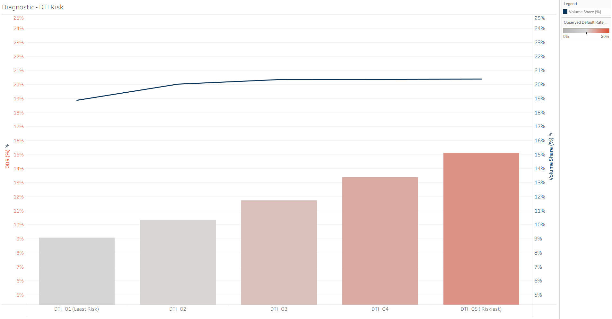
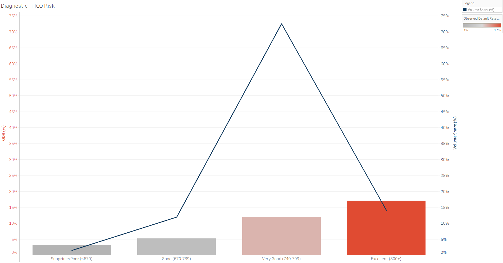

# 📊 Case Study: Mitigating Portfolio Loss in LendingClub Loans
### *A Risk & Compliance Audit to Resolve Systemic Default Rate Breach*

---

## **Project Goal**
To conduct an in-depth data audit to identify the root causes of a critical policy breach - the Observed Default Rate (ODR) exceeding a **10.0%** internal threshold - and provide actionable, segment-level recommendations for immediate portfolio loss mitigation.

### 🔗 [Live Dashboard](https://public.tableau.com/views/CreditRiskandLoanPerformanceAnalysis/Riskvs_ExposureSegmentDrivers?:language=en-US&:sid=&:redirect=auth&:display_count=n&:origin=viz_share_link)
---

# I. The Situation: Critical Policy Breach

| Attribute | Details |
|----------|---------|
| **Project Title** | Credit Risk & Loan Performance Analysis |
| **Author** | Satveer Kaur |
| **Status** | Complete (v1.0) |

---

## 1. The Business Problem
The lending institution faced an immediate crisis as the overall loan portfolio's Observed Default Rate (ODR) had spiked to **≈ 17.06%**. This rate is nearly double the acceptable risk threshold of **10.0%**, signaling a profound failure in current underwriting models and leading to unmanageable losses.

---

## 2. Skills Demonstrated (Snapshot)

- **Business Intelligence (BI):** Translating raw data into an executive-level risk narrative.
- **Python:** Data cleaning, Feature Engineering, and Statistical Analysis.
- **Risk Modeling:** Stratified Sampling, Monotonicity Testing, and Portfolio Exposure Analysis.
- **Data Technologies:** Pandas, NumPy, Scikit-learn, Jupyter Notebooks, Tableau.

---

# II. The Solution: Analytical Methodology

## 3. Data & Tools

| Tool | Purpose | Key Libraries/Versions |
|------|---------|------------------------|
| **Data Source** | LendingClub Accepted Loans Dataset (Historical U.S. P2P loan performance). Access the raw data on [Kaggle](https://www.kaggle.com/datasets/wordsforthewise/lending-club). | N/A |
| **Programming** | Cleaning, Transformation, Risk Metric Calculation | Python (3.10+), Pandas, NumPy |
| **Analysis** | Model Validation and Segmentation | Jupyter Notebooks, Scikit-learn (Stratified Sampling) |

---

## 4. Data Processing Pipeline

The audit followed a structured, four-phase analytical pipeline to ensure the findings were statistically sound and reproducible:

### **Phase 1: Defining the Target**
- Initial data quality checks (null handling, feature selection).
- Defined the binary target variable: `is_default` (derived from `loan_status`).

### **Phase 2: Risk Segmentation**
- Created policy-aligned categorical features: Debt-to-Income (DTI) Quintiles, FICO Score Groups, and Income Groups.
- Used Stratified Sampling to create a representative analytical sample.

### **Phase 3: Validation & Auditing**
- **Monotonicity Testing**: Ensured that as a risk segment increases (e.g., DTI Quintile 1 to 5), the ODR also consistently increases. This validates the segments as strong predictors.

### **Phase 4: Reporting & Export**
- Applied validated feature logic to the full dataset.
- Generated final Executive Risk Tables and exported the segmented data `final_tableau_source.csv` ready for ingestion by a Business Intelligence tool (Tableau).

---

# III. The Outcome: Key Insights & Recommendations

## 5. Executive Summary
The audit confirmed the approx. 17.06% ODR policy failure. The primary driver of the loss is a failure in capacity-based underwriting, specifically the over-exposure to high-leverage Debt-to-Income (DTI) borrowers, which accounts for a disproportionate share of portfolio losses.  A secondary, systemic issue of Risk Inversion was identified in the highest FICO score tiers and, less severely, in the highest income group

---

### **A. Primary Loss Driver: Debt-to-Income (DTI) Exposure Mismatch**

The two highest DTI quintiles (Q4 and Q5) are driving the breach, maintaining an ODR well above the **10.0%** threshold while still constituting **40%** of the total loan volume.



| Risk Segment | ODR (Observed Default Rate) | Volume % of Portfolio |
|--------------|-----------------------------|------------------------|
| **DTI_Q1 (Lowest Risk)** | 5.51% | 19.99% |
| **DTI_Q5 (Highest Risk)** | 15.15% | 19.99% |

---

### **B. Systemic Issue: Dual Risk Inversion (FICO and High Income)**

The analysis revealed counter-intuitive findings in both credit quality and capacity, where the absolute best segments showed higher-than-expected risk. This signals a failure in current pricing models where premium borrowers are either mispriced or potentially adverse selection is occurring.



| Segment | ODR Observation | Implication |
|---------|------------------|-------------|
| **FICO Excellent (800+)** | 6.84% (higher than 740–799 at 6.47%) | Pricing failure or adverse selection |
| **Income > $150k** | ODR elevated compared to next tier | High-earner financial volatility, possible self-employment concentration |

---

## 7. Conclusion & Actionable Recommendations

Based on empirical evidence, two immediate, high-impact policy changes are recommended:

### **1. Immediate Capacity Fix**
Halt originations in the DTI Quintile 5 segment. This action is projected to offer the fastest reduction in portfolio ODR by restricting the highest-loss segment, bringing the total ODR closer to the 10 % target.

### **2. Strategic Pricing Fix**
Initiate a deep-dive actuarial review of the FICO Excellent (800+) product and the Income > $150k product to resolve the observed Dual Risk Inversion and adjust interest rates accordingly.

---

# IV. Repository Navigation & Setup

## 8. **File/Folder Overview**

| Path | Contents | Description |
| :--- | :--- | :--- |
| `notebooks/` | **`01_data_cleaning.ipynb`** | Initial data ingestion, cleaning, and preparation of core features. |
| | **`02_target_sampling_and_setup.ipynb`** | Definition of the default target and creation of the statistically representative analytical sample. |
| | **`03_eda_and_feature_engineering.ipynb`** | Exploratory Data Analysis, creation of risk segments (DTI, FICO, Income), and Monotonicity testing. |
| | **`04_final_analysis_and_reporting.ipynb`** | Generation of final Executive Risk Tables, visualizations, and export of BI-ready data. |
| `data/processed/` | **`risk_segmentation_report.xlsx`** | **Final Deliverable:** The Excel report containing key risk segmentation tables. |
| `README.md` | The document you are reading. | The document you are reading. |
| `assets/` | **`dti_chart.png`** | Static image export of the DTI chart, including the legend for clarity. |
| `assets/` | **`fico_chart.png`** | Static image export of the FICO chart, including the legend for clarity. |

***Note: All intermediate and final source data files (e.g., `final_tableau_source.csv`) are excluded from this repository due to large file size limitations.***

---

## 9. Installation & Execution

To run the analysis locally and reproduce the final report, please follow these steps:

1.  **Dependencies:** Install required Python libraries:

    ```
    pip install pandas numpy scikit-learn seaborn jupyter
    ```

2.  **Data Acquisition:** Obtain the historical LendingClub Accepted Loans Dataset and place it in a `data/raw/` directory with the filename `loan_data_raw.csv`. **You can download the raw data directly from [this source](https://www.kaggle.com/datasets/wordsforthewise/lending-club).**

3.  **Execution:** Run the Jupyter notebooks in sequence (`01` through `04`) to clean the data, engineer the features, and generate the final processed file.

## 10. Glossary of Terms

| Acronym | Definition |
| :--- | :--- |
| **ODR** | **Observed Default Rate:** The percentage of loans in the portfolio that have officially defaulted or been charged off. |
| **DTI** | **Debt-to-Income:** A key credit metric indicating a borrower's monthly debt payments divided by their monthly gross income. |
| **FICO** | **FICO Score:** A commonly used credit score used to assess creditworthiness. |
| **BI** | **Business Intelligence:** Tools used to visualize data and derive insights (e.g., Tableau, Power BI). |
